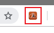
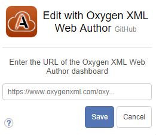
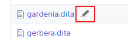
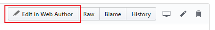

# Oxygen XML Web Author GitHub extension

<br/>

Open supported documents from GitHub repositories directly in Oxygen XML Web Author.

Supported browsers: Google Chrome, Mozilla Firefox.

Supported file extensions: xml, dita, ditamap, ditaval, xhtml.

<br/>

## How to use

<br/>

1) Click on extension icon on top right corner of your browser.




2) Enter Oxygen XML Web Author dashboard URL in input field.




3) Open the GitHub repository with wanted documents and click Web Author pencil.




3.1) or open the document and click ```Edit in Web Author```



<br/>

## Installation

<br/>

### Chrome Web Store  
[](#)


### Mozilla Add-ons
[](#)

<br/>

## [Developers](docs/DEV.md)

Click [here](docs/DEV.md) for details.


